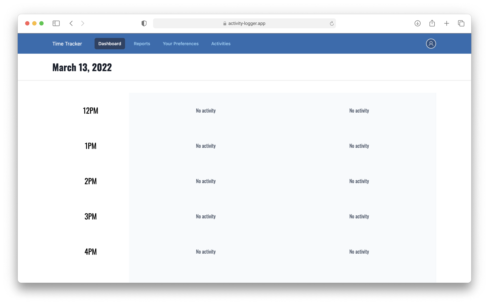

# Activity Logger App


Keep track of your time easily with Activty Logger App (Demo only)

## Features

- Built in user authentication
- Add activities to keep track
- Take notes on activities
- Built with TailwindCSS

## About

Activity Logger is a super simplye time tracking app. You can use the demo app at [activity logger app](https://activity-logger.vercel.app/). It is built with NextJS, Prisma, and Tailwind CSS. All the data is stored in PostgreSQL database.

## Development

Clone and install

```bash
npx degit madebyaman/activity-logger
cd activity-logger
npm install
```

Copy `.env.example` and create your own `.env` file.

Initialize prisma client

```bash
npx prisma generate
npx prisma migrate deploy
```

Run the development server:

```bash
npm run dev
# or
yarn dev
```

Get app password from Google. [Check how to do this.](support.google.com/accounts/answer/185833)

Open [http://localhost:3000](http://localhost:3000) with your browser to see the result.
