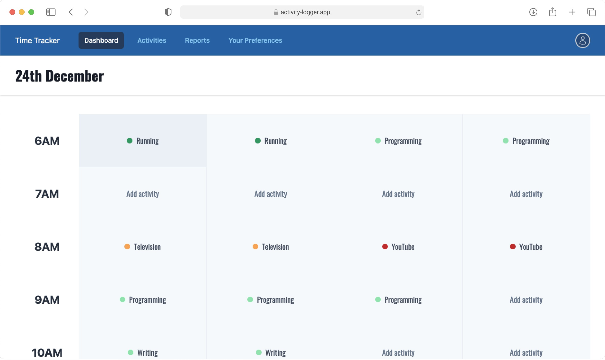

# Activity Logger App


Keep track of your time easily with Activty Logger App (Demo only)

## About

Activity Logger is a super simplye time tracking app. You can use the demo app at [activity logger app](https://activity-logger.vercel.app/). It is built with NextJS, Typescript, Prisma, and Tailwind CSS. All the data is stored in PostgreSQL database hosted in [render](https://render.com).

### Tech Stack

- NextJS
- Typescript
- Prisma
- Tailwind CSS
- SWR, Axios for data management
- PostgreSQL as database
- Jest for unit testing
- Cypress for end to end testing
- Nodemailer for email verification

### Features

- Complete user auth signin, signup, verify email, reset password
- Add activities to keep track of your daily activities
- Fill in the activities as you go
- Take notes on activities
- View all the activities and reports
- Built with TailwindCSS

## Development

Clone and install

```bash
npx degit madebyaman/activity-logger
cd activity-logger
yarn
```

Create environment variables

```bash
cp .env.development_template .env.development.local
cp .env.production_template .env.production.local
cp .env.test_template .env.test.local
```

You need few variables to get started:

1. `PRIVATE_KEY` as random string for json web token to signin and signup
2. `DATABASE_URL` a postgres local db or a hosted one.
3. `GOOGLE_USER` your google email is needed to send emails.
4. `GOOGLE_APP_PASSWORD` Create your [google app password](https://support.google.com/mail/answer/185833?hl=en) for nodemailer.
5. `TEST_EMAIL` enter any email to create a test user.
6. `TEST_PASSWORD` enter password for test user.

Initialize prisma client

```bash
npx prisma generate
npx prisma migrate deploy
```

Run the development server:

```bash
npm run dev
# or
yarn dev
```

Open [http://localhost:3000](http://localhost:3000) with your browser to see the result.
